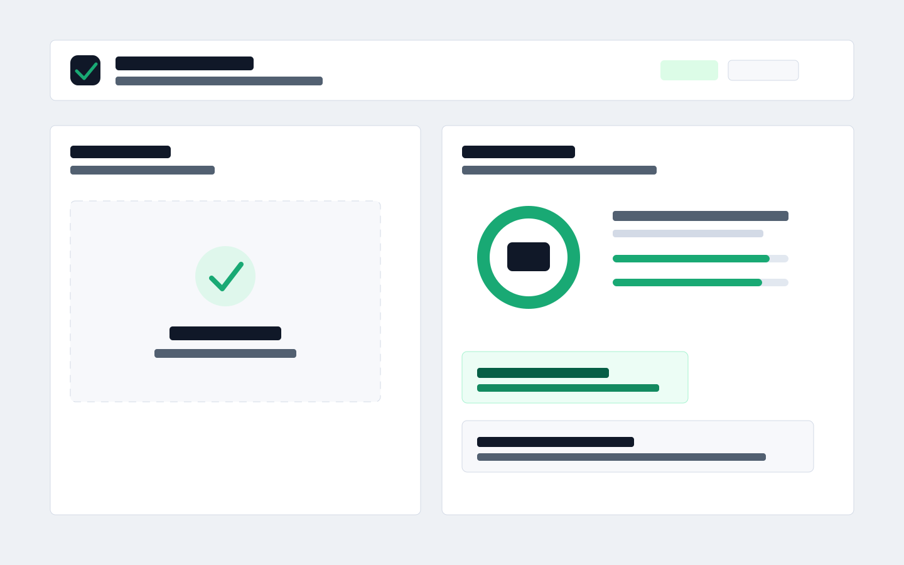
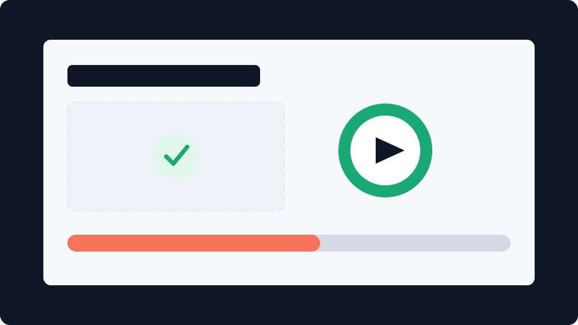

<p align="center">
  
</p>

<h1 align="center">UI Auditor AI</h1>

<p align="center">
  Local-first screenshot audits for developers, LLM coding agents, and product teams fixing UI regressions.
</p>

<p align="center">
  <a href="LICENSE"></a>
  
  
  
  
  
  
  <a href="https://github.com/shahroz-a/ui-auditor-ai/stargazers"></a>
  <a href="https://github.com/shahroz-a/ui-auditor-ai/issues"></a>
  
</p>





## Features

- Local screenshot upload, drag-and-drop, file replacement, and clipboard paste.
- PNG, JPG, JPEG, WebP, and AVIF validation with zero-byte, unsupported format, oversized file, and decode recovery.
- Browser-only canvas sampling for contrast spread, visual density, edge crowding, layout balance, and screenshot quality signals.
- Deterministic audit engine with issue regions, confidence, score impact, recommendations, and severity colors.
- Annotated screenshot review with original, annotated, split, grid, spacing guide, and typography baseline modes.
- Responsive review modes for 320, 375, 390, 414, 768, 1024, 1280, 1440, and custom widths.
- Issue explorer with search, severity/category filters, top fixes, click-to-focus, resolved/ignored states, and copyable summaries.
- Local exports for annotated PNG, printable PDF, JSON, Markdown, and CSV.
- URL capture fallback that explains browser security limits and keeps an extension capture path ready.
- Local CLI for JSON or Markdown audit reports that can be handed to coding agents.
- Stdio MCP server so LLM clients can audit screenshots without a hosted backend.
- Dark-mode-ready styles, visible focus states, semantic regions, and reduced-motion support.

## Installation

```bash
git clone https://github.com/shahroz-a/ui-auditor-ai.git
cd ui-auditor-ai
npm ci
npm run dev
```

Open http://localhost:3000 and upload or paste a PNG, JPG, JPEG, WebP, or AVIF screenshot.

## Developer And LLM Workflows

UI Auditor AI can run as a local browser app, a CLI, or an MCP server. The intended loop is:

1. Capture a product screenshot with Playwright, Storybook, Cypress, or manually.
2. Run a local audit at the viewport being reviewed.
3. Give the report to an LLM coding agent.
4. Let the agent patch the product UI, rerun the screenshot, and re-audit.

CLI:

```bash
npm run audit -- audit ./screenshots/dashboard.png --viewport 1440 --format json
npm run audit -- audit ./screenshots/mobile.png --viewport 390 --format markdown --out audit.md
```

MCP:

```bash
npm run mcp
```

The CLI and MCP server are local-only and do not upload screenshots. They currently run metadata-based checks in Node; use the browser app for pixel-sampled overlays and visual-density findings.

Read [docs/llm-integration.md](docs/llm-integration.md) for MCP config, CI examples, and agent prompts.

## Architecture

The app is split by responsibility instead of by framework convention alone:

- `app/` contains the Next.js shell and global styles.
- `features/audit/` owns the screenshot audit workflow.
- `components/ui/` contains reusable primitives.
- `engine/` turns image metadata and rule results into reports.
- `rules/` holds small, testable quality rules.
- `bin/` exposes the local CLI and MCP entry points.
- `lib/node-audit.mjs` contains the Node metadata audit adapter used by CLI/MCP.
- `hooks/` owns browser state such as object URLs and upload lifecycle.
- `types/` defines the report, finding, rule, and upload contracts.

Read [ARCHITECTURE.md](ARCHITECTURE.md) and [docs/rule-engine.md](docs/rule-engine.md) for the deeper version.

## Screenshots

The repository includes a generated hero screenshot at [public/hero-screenshot.svg](public/hero-screenshot.svg). Replace it with a production screenshot after the first hosted release.

## Roadmap

- Pixel sampling for contrast and color-token drift.
- OCR-assisted typography checks.
- Batch audits for multiple breakpoints through CLI and MCP.
- GitHub pull request annotations.
- Before/after screenshot comparison for coding agents.
- Browser pixel metrics in the Node integration path.

See [ROADMAP.md](ROADMAP.md) for the maintained roadmap.

## Contributing

Contributions should be small, tested, and easy to review. Start with [CONTRIBUTING.md](CONTRIBUTING.md), then check open issues labeled `good first issue` or `help wanted`.

Useful commands:

```bash
npm run lint
npm run typecheck
npm run test
npm run build
npm run test:e2e
```

## FAQ

**Does this upload images to a server?**  
No. The current app reads image metadata and samples pixels in the browser. It does not send screenshots to an API, backend, database, or cloud worker.

**Can it capture any URL directly?**
Not from a normal web page. Browsers block arbitrary cross-origin screenshots, so URL analysis explains the limitation and points users to upload, paste, or future extension capture.

**Is this a replacement for manual design review?**  
No. It catches review risks and makes them visible before a human signs off.

**Can I add custom rules?**  
Yes. Add a `RuleDefinition` in `rules/` and cover it with a unit or integration test.

## Benchmarks

Initial target budgets:

| Area | Target |
| --- | ---: |
| Lighthouse Performance | 95+ |
| Lighthouse Accessibility | 100 |
| Lighthouse Best Practices | 100 |
| Lighthouse SEO | 100 |
| Local audit runtime | Under 200ms for metadata-only rules |

Performance notes live in [docs/performance.md](docs/performance.md).

## Acknowledgements

Built for product engineers, designers, and reviewers who want UI quality checks to happen before regressions reach users.

## Built By

Built by [Shahroz](https://www.shahrozahmad.com) from [Aier Labs](https://www.aierlabs.com).

- Portfolio: https://www.shahrozahmad.com
- LinkedIn: https://www.linkedin.com/in/shahroz-a/
- GitHub: https://github.com/shahroz-a
- X: https://x.com/beatsbyshaz

## Support

- Star the repository.
- Open an issue.
- Suggest a feature.
- Submit a pull request.
- Share it with friends.

## License

MIT. See [LICENSE](LICENSE).
